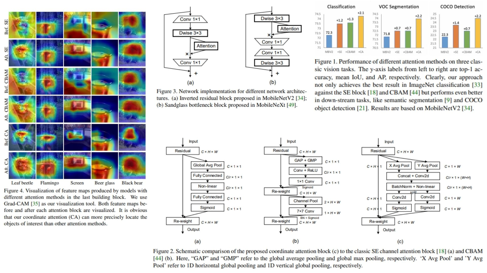

# 🧭 CoordAttention-Replication – Coordinate Attention for Efficient Mobile Networks

This repository provides a **faithful PyTorch replication** of  
**Coordinate Attention for Efficient Mobile Network Design**.

The goal is to **translate the original paper architecture, math, and block design**
directly into clean, modular, and readable code —  
focusing on **theoretical correctness and structural fidelity**, not training or benchmarking.

- Encodes **long-range spatial dependencies** with direction-aware attention 🜂  
- Preserves **positional information** along height and width axes ⟂  
- Lightweight, mobile-friendly, and **drop-in for any CNN backbone** ⚙︎  

**Paper reference:** [Coordinate Attention – Hou et al., 2021](https://arxiv.org/abs/2103.02907) 📄

---

## 🗺 Overview – Coordinate Attention Pipeline



The core idea:

> Decompose spatial attention into **two 1D feature encodings** along height and width,
> enabling the network to capture **long-range dependencies with precise positional awareness**.

High-level procedure:

1. Extract feature map  
   $$X \in \mathbb{R}^{C \times H \times W}$$

2. Apply directional global pooling:

   Height encoding:
   $$z_h(c, h) = \frac{1}{W} \sum_{i=1}^{W} X(c, h, i)
   \quad\Rightarrow\quad
   z_h \in \mathbb{R}^{C \times H \times 1}$$

   Width encoding:
   $$z_w(c, w) = \frac{1}{H} \sum_{j=1}^{H} X(c, j, w)
   \quad\Rightarrow\quad
   z_w \in \mathbb{R}^{C \times 1 \times W}$$

3. Concatenate coordinate embeddings:
   $$z = [z_h, z_w] \in \mathbb{R}^{C \times (H+W) \times 1}$$

4. Apply shared transform:
   $$f = \delta(\text{BN}(\text{Conv}_{1\times1}(z)))$$

5. Split features and generate attention maps:
  $$g_h = \sigma(F_h(f_h)), \quad
  g_w = \sigma(F_w(f_w))$$


6. Apply coordinate attention:
   $$Y = X \odot a_h \odot a_w$$

Where:
- $\delta$ is a non-linear activation (ReLU / h-swish)
- $\sigma$ is the sigmoid function
- $\odot$ denotes element-wise multiplication with broadcasting

---

## 🧮 Coordinate Attention – Math Essentials

### Direction-aware Context Encoding

Height context:
$$z_h(c, h) = \frac{1}{W} \sum_{i=1}^{W} X(c, h, i)$$

Width context:
$$z_w(c, w) = \frac{1}{H} \sum_{j=1}^{H} X(c, j, w)$$

---

### Shared Embedding Transform

Concatenation:
$$z = [z_h, z_w]$$

Projection:
$$f = \delta(\text{BN}(\text{Conv}_{1\times1}(z)))$$

Split:
$$f \rightarrow (f_h, f_w)$$

---

### Attention Generation

Height attention:
$$a_h = \sigma(\text{Conv}_{1\times1}(f_h))$$

Width attention:
$$a_w = \sigma(\text{Conv}_{1\times1}(f_w))$$

---

### Feature Recalibration

Final output:
$$Y = X \odot a_h \odot a_w$$

Each spatial location is modulated by both its **row-wise** and **column-wise** importance.

---

## 🧠 What the Module Does

- Encodes **long-range dependencies** without 2D self-attention  
- Preserves **precise positional information** via coordinate decomposition  
- Separates spatial modeling into **height and width attention**  
- Extremely lightweight and mobile-friendly  
- Fully modular and backbone-agnostic  

---

## 📦 Repository Structure

```bash
CoordAttention-Replication/
├── src/
│   ├── layers/
│   │   ├── conv_layer.py          # 1x1 Conv wrapper
│   │   ├── activation.py          # ReLU, h-swish, Sigmoid
│   │   └── normalization.py       # BatchNorm
│   │
│   ├── pooling/
│   │   ├── height_pool.py        # H-direction global pooling
│   │   ├── width_pool.py         # W-direction global pooling
│   │   └── concat_pool.py        # z_h + z_w concatenation
│   │
│   ├── attention/
│   │   ├── coord_embedding.py    # Coordinate encoding (Eq. 4–5)
│   │   ├── coord_attention.py    # Attention generation (Eq. 6–9)
│   │   └── coord_block.py        # Full Coordinate Attention block
│   │
│   ├── backbone/
│   │   └── mobilenetv2_blocks.py # Inverted residual + CoordAtt
│   │
│   ├── model/
│   │   └── coord_cnn.py          # Backbone + CoordAtt forward logic
│   │
│   └── config.py                 # reduction ratio, block positions
│
├── images/
│   └── figmix.jpg                # Coordinate Attention overview
│
├── requirements.txt
└── README.md
```
---


## 🔗 Feedback

For questions or feedback, contact: [barkin.adiguzel@gmail.com](mailto:barkin.adiguzel@gmail.com)
